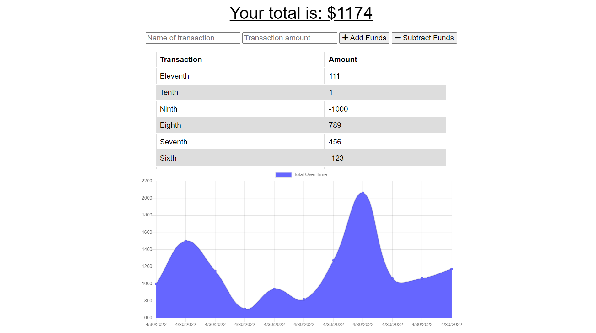
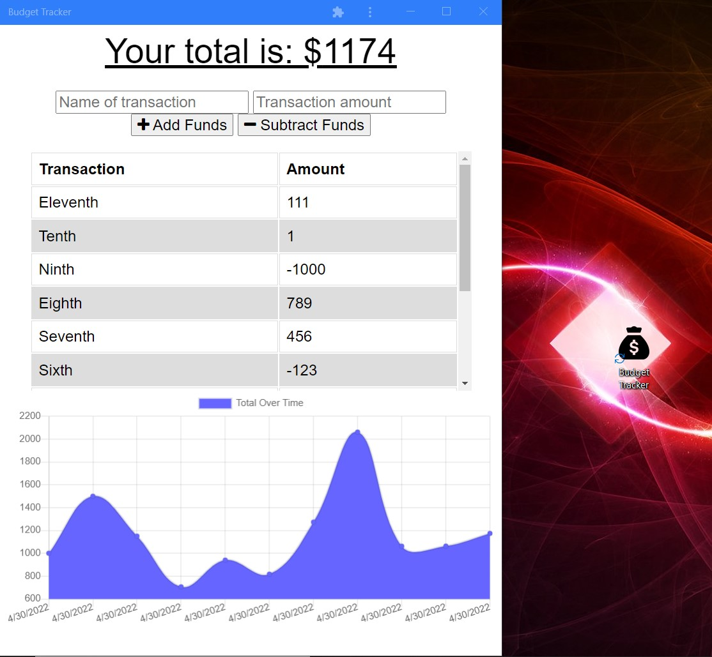

# NoSQL Challenge: Social Network API

## Description

```
The client requested a PWA budget tracker that can be used  while traveling
and with limited to no online connectivity. The requirements are to use
indexedDB, a service worker, a web manifest, and that it must be deployed on Heroku.
```

## User Story

```
AS AN avid traveler
I WANT to be able to track my withdrawals and deposits with or without a data/internet connection
SO THAT my account balance is accurate when I am traveling

```

## Acceptance Criteria

```
- It is done when the user inputs an expense or deposit and then receives a notification
that they have added an expense or deposit.

- It is done when the user reestablishes an internet connection, and then the deposits
or expenses added while they were offline are added to their transaction history and
their totals are updated.
```

The following images demonstrate the application functionality:





## Review

You are required to submit the following for review:

- The URL of the functional, deployed application: https://budget-tracker1234567.herokuapp.com/
- The URL of the GitHub repository: https://github.com/sstover25/Budget_Tracker

---

## Installation

```
To use this application, you must have the following dependencies installed:
- Mongoose
- Express
- Compression
- Morgan
```

## Credits

```
Coding assistance from KU bootcamp modules, the TA office hours, MDN, and Stack Overflow.
```

© 2021 Trilogy Education Services, LLC, a 2U, Inc. brand. Confidential and Proprietary. All Rights Reserved.
